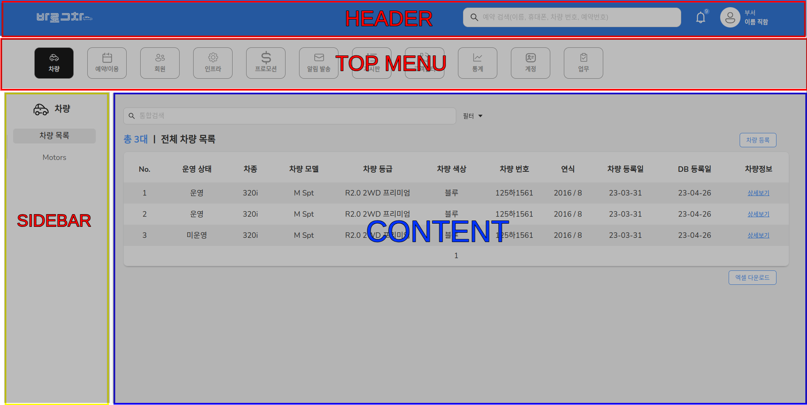

Refer Material UI Components https://mui.com/material-ui/getting-started/

# How to run project

nstall mode module

```
npm install / yarn
```

Set endpoint API .env file

```
REACT_APP_BASE_URL=https://global3.hanbiro.com/ngw
```

Start dev server run

```
npm run start
yarn start
```

The web browser auto open URL below
 http://localhost:3000/

# How to create new menu

1. Create new menu folder with require folders or Copy exist folder menu (Change folder name, route name...)
2. Add new menu in database (or add new menu in topMenuData in src/base/layouts/_mocks/menu.tsx if no api)
3. Define route menu & submenu in @{newmenu}/routes/Route.tsx
4. Define folder paths in config-overrides.js and tsconfig.json

*Related files:* src/base/layouts/_mocks/menu.tsx, @base/hooks/useMenu.tsx, src/base/store/atoms/menu.ts

# UI Component (Ant design)

Refer antd UI Components [https://ant.design/components/overview](https://ant.design/components/overview)

# Source organization & define

|              |                 |                     |                      |   | Description                                        |
| ------------ | --------------- | ------------------- | -------------------- | - | -------------------------------------------------- |
| source       |                 |                     |                      |   |                                                    |
|              | base            |                     |                      |   |                                                    |
|              |                 | assets              |                      |   |                                                    |
|              |                 |                     | fonts                |   | Define usage fonts                                |
|              |                 |                     | icons, images        | - | Define usage components icons, image               |
|              |                 | components          |                      | - | Commmon component                                  |
|              |                 |                     | GlobalStyles.css     | - | Define Global Style                                |
|              |                 | configs             |                      | - | Project config (Localization, Personal, Menus ...) |
|              |                 | constants           |                      | - | Project Contants                                   |
|              |                 | contexts            |                      |   |                                                    |
|              |                 |                     | AuthContext.tsx      | - | Authentication Context                             |
|              |                 | hooks               |                      | - | Common hooks (...)                                 |
|              |                 | layouts             |                      | - | Description of layouts                             |
|              |                 |                     | CommonLayout         | - | Layout before login (login / register page)        |
|              |                 |                     | MainLayout           | - | Layout after login (Top menu + pages..)            |
|              |                 | pages               |                      |   |                                                    |
|              |                 |                     | Auth                 | - | Login pages,                                       |
|              |                 | routes              |                      |   |                                                    |
|              |                 |                     | AuthorizedRoutes.tsx | - | All menus routers                                  |
|              |                 |                     | LoginRoutes.tsx      | - | Login routers                                      |
|              |                 |                     | index.tsx            |   |                                                    |
|              |                 | services            |                      | - | Define service call API                            |
|              |                 | store               |                      |   |                                                    |
|              |                 |                     | atoms                | - | Define atoms stores                                |
|              |                 | types               |                      | - | Define typescript Types                            |
|              |                 | utils               |                      | - | Common function                                    |
|              | {other menu...} | base's structure... |                      | - | Have structure like base                           |
|              |                 | containers          |                      |   |                                                    |
|              |                 |                     | MainContainer        | - | Wrapper all menu content                           |
| public       |                 |                     |                      |   |                                                    |
|              | .htaccess       |                     |                      |   |                                                    |
|              | index.html      |                     |                      |   |                                                    |
|              | favicon.svg     |                     |                      |   |                                                    |
|              | ...             |                     |                      |   |                                                    |
| node_modules |                 |                     |                      |   |                                                    |
|              | ...             |                     |                      |   |                                                    |

# Main Layout

***Related folder:*** src/base/layouts/MainLayout/


